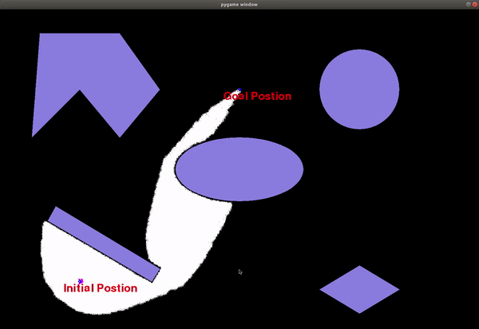

# ENPM661-ProjectThree
# A* algorithm for path planning of robot.

## Overview

Path planning is a problem that every mobile robot has to solve in order to
move around in its environment. There are multiple approaches to solve this
problem, one of which is A* algorithm. 
 
A* algorithm is a path searching algorithm which uses Heuristics to increase 
performance while maintaining optimality of the output. A* is very efficient
when compared to other primitive search algorithms such as brute force.  

## Dependencies

- Python 3.6.9
- pygame 1.9.6


#### Installing pygame
```
pip install pygame
```

## Demo Steps
```
open terminal in project folder
python Astar_rigid.py
- Enter Radius
- Enter Clearance
- Enter start positon x
- Enter start positon y
- Enter start positon theta
- Enter goal positon x
- Enter goal positon y
- Enter step size
```

## Results



#### Runtime

It takes approximately 20 seconds for start: (50,30,60), goal: (150, 150), radius: 1, clearance: 1 and step size: 1.

System configuration- 
- CPU: Intel Core i7-9750H @3.9 GHz x12
- RAM: 16 GB

## Contributors

- Toyas Dhake

- Loic Barret